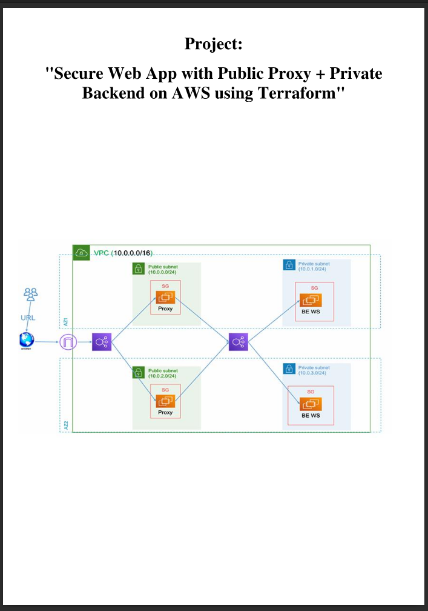
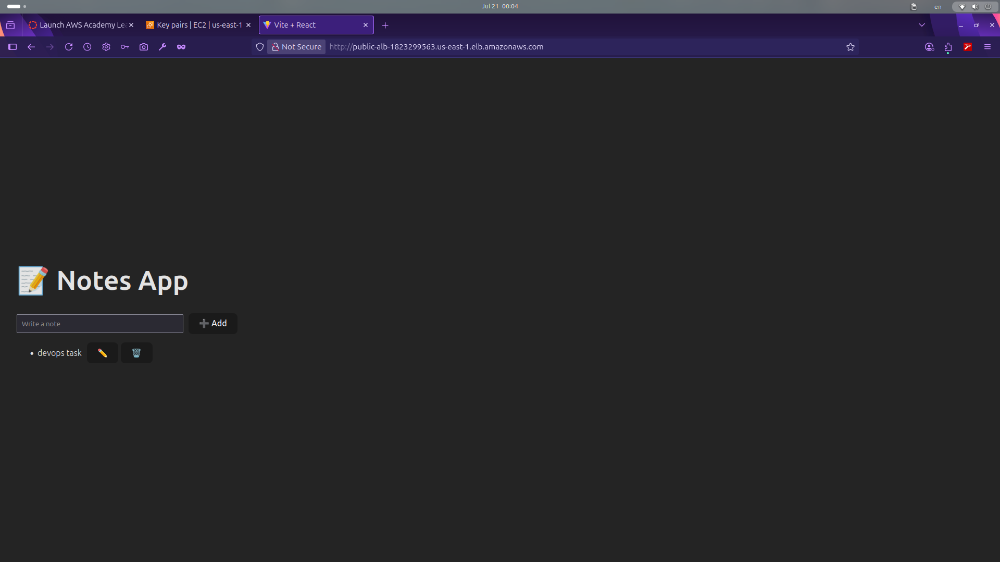

# 🌐 Full-Stack Web App on AWS with Terraform
## 🚀 Architecture Overview

# AWS VPC Architecture: Nginx Reverse Proxy with Internal Web App Backends

## 📘 Overview

This project sets up a secure, scalable, and modular AWS VPC infrastructure with public-facing Nginx reverse proxies and private backend application servers. Traffic flows through multiple layers to ensure proper routing, security, and load balancing.

---

## 🖥️ Deployed Application

👉 **Full-Stack Node.js + React App Repository**  
GitHub: [muhammedhamedelgaml/fullStack-node.js-react](https://github.com/muhammedhamedelgaml/fullStack-node.js-react)

This repository contains the full-stack application (React frontend + Node.js backend) deployed in this VPC setup.

---

## 🏗️ Architecture Components

  

Internet
   │
   ▼
[Internet Gateway]
   │
   ▼
[Public ALB]
   │
   ▼
[Public Subnets]
   ├── EC2 Nginx Reverse Proxy (Nginx 1)
   └── EC2 Nginx Reverse Proxy (Nginx 2)
   │
   ▼
[Internal ALB]
   │
   ▼
[Private Subnets]
   ├── EC2 Web App ( Node.js 1)
   └── EC2 Web App ( Node.js 2)
   │
   ▼
[NAT Gateway] ← [Internet Gateway for egress traffic]

---

## 🌐 Network Design

### VPC
- Custom VPC with multiple subnets across 2 Availability Zones.

### Subnets
- **2 Public Subnets**: Host Nginx Reverse Proxy EC2 instances.
- **2 Private Subnets**: Host Web Application EC2 instances (Node.js backend).

### Gateways
- **Internet Gateway**: Provides internet access to the public subnets and NAT Gateway.
- **NAT Gateway**: Allows private subnet instances to access the internet (e.g., for updates, API calls).

---

## ⚙️ Load Balancers

### Public ALB
- Internet-facing.
- Accepts HTTP(S) requests from the public.
- Routes requests to Nginx EC2 instances in the public subnet.

### Internal ALB
- Private/internal.
- Accepts requests from Nginx reverse proxies.
- Routes requests to backend application EC2 instances in private subnets.

---

## 🧱 EC2 Instances

### Nginx Reverse Proxy (Public Subnets)
- Acts as the first point of entry.
- Routes incoming traffic to the internal load balancer.
- Optional: SSL/TLS termination, caching, basic rate limiting.

### Web Application Backends (Private Subnets)
- Hosts application code from the [Node.js + React Repo](https://github.com/muhammedhamedelgaml/fullStack-node.js-react).
- Processes requests passed from the reverse proxy via the internal ALB.
- Can connect to databases, message queues, or external APIs via NAT.

---

## 🔐 Security Best Practices

- Use **Security Groups** to tightly control access between layers.
- Public ALB: Open only HTTP/HTTPS to the world.
- Nginx EC2s: Accept traffic only from Public ALB.
- Internal ALB: Accept traffic only from Nginx EC2s.
- Backend EC2s: Accept traffic only from Internal ALB.

---

## 📈 Scalability & Availability

- Deployed across **2 Availability Zones** for high availability.
- Load balancers ensure traffic is evenly distributed.
- Infrastructure supports auto scaling of EC2 instances (optional).

---

## 🚀 Getting Started

### Prerequisites
- AWS CLI configured
- IAM permissions to provision EC2, ALB, VPC, IGW, NAT, etc.
- Terraform, AWS CDK, or CloudFormation for IaC

### Suggested Setup Steps
1. Create the VPC and subnets.
2. Deploy the Internet Gateway and NAT Gateway.
3. Configure the public and internal Application Load Balancers.
4. Launch EC2 instances with appropriate roles (Nginx, App).
5. Set up routing and security groups.
6. Clone and deploy the full-stack app at ec2s from :
   [https://github.com/muhammedhamedelgaml/fullStack-node.js-react](https://github.com/muhammedhamedelgaml/fullStack-node.js-react)
7. 

---

